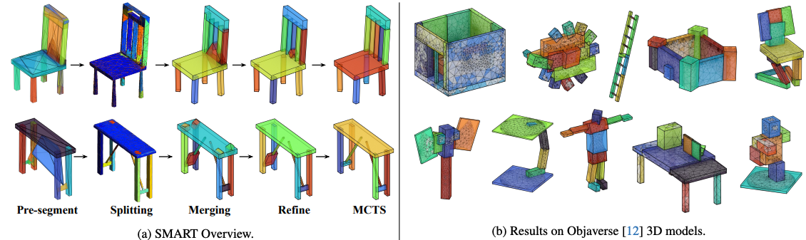

# Split, Merge, and Refine: Fitting Tight Bounding Boxes via Over-Segmentation and Iterative Search (SMART), 3DV 2024



[**arXiv**](https://arxiv.org/abs/2304.04336) | [**Paper**](https://arxiv.org/pdf/2304.04336)

[Chanhyeok Park](https://chpark1111.github.io/), [Minhyuk Sung](https://mhsung.github.io/)

# Introduction

This repository contains the official implementation of **Split, Merge, and Refine: Fitting Tight Bounding Boxes via Over-Segmentation and Iterative Search a.k.a. SMART**. SMART is a shape abstraction **technique for finding tight bounding boxes of 3D meshes** without requiring any human supvervision. These rich bounding boxes can be utilized for various downstream tasks like **segmentation, deformation, generation, abstraction, collision detection, and more**.

> Achieving tight bounding boxes of a shape while guaranteeing complete boundness is an essential task for efficient geometric operations and unsupervised semantic part detection. But previous methods fail to achieve both full coverage and tightness. Neural-network-based methods are not suitable for these goals due to the non-differentiability of the objective, while classic iterative search methods suffer from their sensitivity to the initialization. We propose a novel framework for finding a set of tight bounding boxes of a 3D shape via over-segmentation and iterative merging and refinement. Our result shows that utilizing effective search methods with appropriate objectives is the key to producing bounding boxes with both properties. We employ an existing pre-segmentation to split the shape and obtain over-segmentation. Then, we apply hierarchical merging with our novel tightness-aware merging and stopping criteria. To overcome the sensitivity to the initialization, we also define actions to refine the bounding box parameters in an Markov Decision Process (MDP) setup with a soft reward function promoting a wider exploration. Lastly, we further improve the refinement step with Monte Carlo Tree Search (MCTS) based multi-action space exploration. By thoughtful evaluation on diverse 3D shapes, we demonstrate full coverage, tightness, and an adequate number of bounding boxes of our method without requiring any training data or supervision. It thus can be applied to various downstream tasks in computer vision and graphics.

# Todos

- [ ] Add section for installing dependencies.
- [ ] Add split, merge section code.
- [ ] Add refine section code.
- [ ] Add MCTS section code.
- [ ] Add code for full automation of the pipelines.
- [ ] Add renderer for SMART.
- [ ] Add demo mesh, script.
- [ ] Add code for watertight tetrahedral mesh conversion.
- [ ] Add SMART C++ code for acceleration.

# Get Started

## Installation

For main requirements, we have tested the code with the below dependencies.

```
git clone https://github.com/chpark1111/SMART/
cd SMART
conda env create -f environment.yml
conda activate smart
pip install -e .
```

## Building Mainfold (C++ External Libaray)

We provide

# Pipeline

## Split, Merge

This is a section for split and merge.

```
python merge.py
```

## Refine

This is a section for refine:

```
python refine.py
```

## MCTS

This is a section for MCTS:

```
python mcts.py
```

# Renderer

This is a section for rendering bounding boxes (and meshes) used in the paper.

# Demo

This is a section for demo

# Reference

Our bounding box rendering code is based on the [StructureNet](https://github.com/daerduoCarey/structurenet/tree/master)'s [renderer](https://github.com/daerduoCarey/structurenet/tree/master/viz_blender). We thank the authors for opening the rendering code.

## Citation

If you find our work useful, please consider citing:

```bibtex
@inproceedings{Park:2024SMART,
 title={Split, Merge, and Refine: Fitting Tight Bounding Boxes via Over-Segmentation and Iterative Search},
 author={Park, Chanhyeok and Sung, Minhyuk},
 booktitle= {3DV},
 year={2024}
}
```

## License

This work is licensed under a [CC BY-NC-SA 4.0][cc-by-nc-sa].

![CC BY-NC-SA 4.0][cc-by-nc-sa-image]

[cc-by-nc-sa]: http://creativecommons.org/licenses/by-nc-sa/4.0/
[cc-by-nc-sa-image]: https://licensebuttons.net/l/by-nc-sa/4.0/88x31.png
