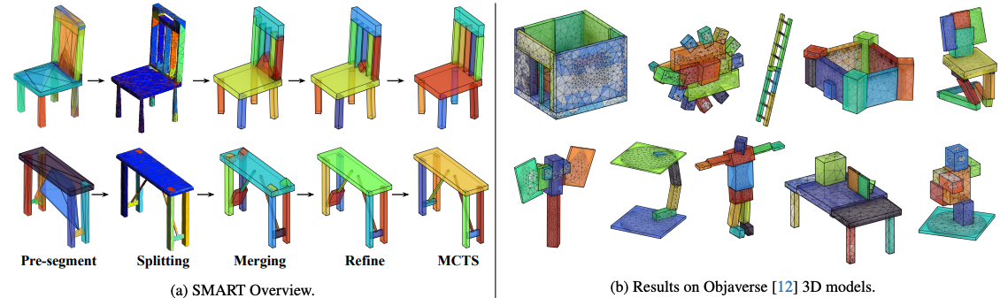

# Split, Merge, and Refine: Fitting Tight Bounding Boxes via Over-Segmentation and Iterative Search (SMART), 3DV 2024



[**arXiv**](https://arxiv.org/abs/2304.04336) | [**Paper**](https://arxiv.org/pdf/2304.04336)

[Chanhyeok Park](https://chpark1111.github.io/), [Minhyuk Sung](https://mhsung.github.io/)

# Introduction

This repository contains the official implementation of **Split, Merge, and Refine: Fitting Tight Bounding Boxes via Over-Segmentation and Iterative Search a.k.a. SMART**. SMART is a shape abstraction **technique for finding tight bounding boxes of 3D meshes** without requiring any human supvervision. These rich bounding boxes can be utilized for various downstream tasks like **segmentation, deformation, generation, abstraction, collision detection, and more**.

> Achieving tight bounding boxes of a shape while guaranteeing complete boundness is an essential task for efficient geometric operations and unsupervised semantic part detection. But previous methods fail to achieve both full coverage and tightness. Neural-network-based methods are not suitable for these goals due to the non-differentiability of the objective, while classic iterative search methods suffer from their sensitivity to the initialization. We propose a novel framework for finding a set of tight bounding boxes of a 3D shape via over-segmentation and iterative merging and refinement. Our result shows that utilizing effective search methods with appropriate objectives is the key to producing bounding boxes with both properties. We employ an existing pre-segmentation to split the shape and obtain over-segmentation. Then, we apply hierarchical merging with our novel tightness-aware merging and stopping criteria. To overcome the sensitivity to the initialization, we also define actions to refine the bounding box parameters in an Markov Decision Process (MDP) setup with a soft reward function promoting a wider exploration. Lastly, we further improve the refinement step with Monte Carlo Tree Search (MCTS) based multi-action space exploration. By thoughtful evaluation on diverse 3D shapes, we demonstrate full coverage, tightness, and an adequate number of bounding boxes of our method without requiring any training data or supervision. It thus can be applied to various downstream tasks in computer vision and graphics.

# Get Started

## Installation

The repo now exposes one Python entrypoint for the full SMART paper pipeline.
The package is built as one mixed Python/Rust wheel: the `smart-bbox` wheel
contains the Python package and the exact PyO3 extension at `smart._rust`.

```
cd SMART
maturin develop --release --extras pipeline
```

Alternatively, if you want pip to drive the editable install, install the
Python `maturin` build backend first and then run
`pip install -e ".[pipeline]"`.

After a PyPI release, users should only need:

```
pip install "smart-bbox[pipeline]"
```

That install path should provide a platform wheel with Rust acceleration already
bundled. Source installs still need Rust/Cargo, maturin, and external tool
builds for the fixed Manifold bridge. The Python code imports `smart._rust` when
available and falls back to Python kernels otherwise.

For package-oriented installation, Python API examples, wheel building, and
future PyPI usage, see [`docs/PYTHON_PACKAGE.md`](docs/PYTHON_PACKAGE.md).

# Pipeline

The default demo config uses the prepared ShapeNet v2 samples:

```text
data/shapenet_airplane/<model_id>/model.obj
data/shapenet_chair/<model_id>/model.obj
data/shapenet_table/<model_id>/model.obj
```

Run a data sanity check:

```
smart --config configs/demo.yaml check-data
```

Check the local runtime, external binaries, vendored Manifold binding, Blender,
and optional Rust tooling:

```
smart --config configs/demo.yaml doctor
smart --config configs/demo.yaml doctor --json
```

If the `smart` console script is not on PATH, use `python -m smart` with the
same arguments.

Build external tools. This downloads/builds ManifoldPlus and fTetWild under
`external/mesh2tet`, and builds the fixed vendored Manifold Python binding under
`smart/vendor/manifold/build`:

```
smart --config configs/demo.yaml build-tools
```

You can also provide prebuilt binaries:

```
export SMART_MANIFOLDPLUS_BIN=/path/to/ManifoldPlus/build/manifold
export SMART_FTETWILD_BIN=/path/to/fTetWild/build/FloatTetwild_bin
export SMART_MANIFOLD_PYTHON=/path/to/smart/vendor/manifold/build/bindings/python
```

Run the complete pipeline:

```
smart --config configs/demo.yaml run
```

Run the checked five-shape smoke profile:

```
smart --config configs/smoke_5.yaml run
smart --config configs/smoke_5.yaml summary
smart --config configs/smoke_5.yaml evaluate --stage mcts
```

Run the paper-safe exact profile with the legacy Manifold reward backend:

```
smart --config configs/accelerated_exact.yaml run
```

Run the opt-in exact Rust/stateful profile:

```
smart --config configs/stateful_exact_experimental.yaml run
```

Run the current best exact MCTS acceleration candidate, which keeps the exact
Manifold reward and only enables the stateful leave-one-out union cache:

```
smart --config configs/stateful_union_cache_experimental.yaml run
```

Run the experimental Rust/stateful profile with the smoke-validated
trace-derived MCTS prior:

```
smart --config configs/accelerated_search_experimental.yaml run
```

Run the hybrid MCTS plus fine local-search profile:

```
smart --config configs/hybrid_local_search_experimental.yaml run
```

The stateful profiles are intentionally separate from `accelerated_exact.yaml`.
`manifold_stateful` is still opt-in: the latest smoke sweeps preserve paper
metrics and show a small MCTS speed win after exact reward memoization, but
expanded sweeps are still being accumulated. The strongest current exact MCTS
result is `stateful_union_cache=true`: on one MCTS100 10-box airplane case it
kept all reported metric differences at `0` and measured `1.095x`
(`81.80s -> 74.67s`); on the current 16 processed meshes at MCTS20 it measured
`1.047x`. Use `accelerated_exact.yaml` for paper-style reporting until larger
MCTS100/MCTS300 parity sweeps pass.
Explicit `mcts.backend=rust` and `mcts.backend=rust_stateful` are guarded behind
`mcts.allow_search_order_changes=true` because the Rust MCTS runner can change
the search trajectory even when the reward backend is exact.

Pipeline order:

```text
normalize -> tetra -> preseg -> merge -> refine -> mcts -> render
```

See [`docs/SMART_PIPELINE.md`](docs/SMART_PIPELINE.md) for the paper-to-code
stage mapping, parameter notes, and Rust migration roadmap. See
[`docs/CURRENT_STATUS.md`](docs/CURRENT_STATUS.md) for the current applied vs
experimental status. See
[`docs/OPTIMIZATION_IDEAS.md`](docs/OPTIMIZATION_IDEAS.md) for the prioritized
runtime and quality improvements to consider before deeper Rust migration. See
[`docs/MANIFOLD_PERFORMANCE_NOTES.md`](docs/MANIFOLD_PERFORMANCE_NOTES.md) for
the fixed Manifold bridge bottleneck analysis. See
[`docs/PYTHON_PACKAGE.md`](docs/PYTHON_PACKAGE.md) for Python package install and
library usage. See [`docs/RL_RESEARCH_PLAN.md`](docs/RL_RESEARCH_PLAN.md) for the
category-general RL/action-prior research direction.

Normalization writes centered, scale-normalized OBJ files under
`runs/<profile>/normalized/` and leaves `data/` untouched. The default mode
sets each mesh bbox diagonal to `1.0`, matching the prepared ShapeNet sample
scale and the Mesh2Tet parameters. To force radius-1 unit-sphere normalization,
set `normalization.mode: unit_sphere` in the config.

Tetrahedral validation requires `tetra.msh` and a watertight
`tetra.msh__sf.obj`. Disconnected watertight surfaces are allowed by default
because ShapeNet-style meshes often contain detached semantic parts and the
downstream SMART stages can process them. Use
`--set tetra.require_single_component=true` only for strict debugging.

Run one stage or one mesh:

```
smart --config configs/demo.yaml normalize --category airplane --mesh 172764bea108bbcceae5a783c313eb36
smart --config configs/demo.yaml tetra --category airplane --mesh 172764bea108bbcceae5a783c313eb36
smart --config configs/demo.yaml preseg --category airplane --mesh 172764bea108bbcceae5a783c313eb36
smart --config configs/demo.yaml merge --category airplane --mesh 172764bea108bbcceae5a783c313eb36
smart --config configs/demo.yaml refine --category airplane --mesh 172764bea108bbcceae5a783c313eb36
smart --config configs/demo.yaml mcts --category airplane --mesh 172764bea108bbcceae5a783c313eb36
smart --config configs/demo.yaml render --category airplane --mesh 172764bea108bbcceae5a783c313eb36
```

Override any config value from the command line without editing YAML:

```
smart --config configs/smoke_5.yaml --set mcts.mcts_iter=100 run
smart --config configs/smoke_5.yaml --set refine.backend=python refine --category table
smart --config configs/smoke_5.yaml --set mcts.backend=python mcts --category table
smart --config configs/smoke_5.yaml --set merge.only_nearby=true merge --category table
smart --config configs/expanded_processed_16.yaml --set mcts.no_reward_stop_after=20 mcts --category airplane --mesh 123bd9e948881939c38a1d3458dafa1b
smart --config configs/smoke_5.yaml --set render.joint_mesh=true render --category airplane
smart --config configs/smoke_5.yaml --set 'render.variants=["boxes_only","with_mesh"]' render
smart --config configs/smoke_5.yaml --set refine.score_cache_size=0 refine --category chair
smart --config configs/smoke_5.yaml --set refine.summary_metrics=true refine --category chair
```

Use the same pipeline from Python:

```python
import smart

records = smart.run_pipeline(
    "configs/demo.yaml",
    category="airplane",
    meshes=["172764bea108bbcceae5a783c313eb36"],
    overrides={"mcts": {"mcts_iter": 100}},
)
metrics = smart.evaluate("configs/demo.yaml", stage="mcts", category="airplane")
status = smart.doctor("configs/demo.yaml")
```

Outputs and logs are written to `runs/<profile>/`. Each stage appends a JSONL
manifest under `runs/<profile>/manifests`, so Mesh2Tet failures are recorded and
skipped instead of stopping the whole run.

Evaluation uses the metric definitions from `past_codes/Evaluation`: `BVS`,
`MOV`, `TOV`, `Covered`, `vIoU`, `cub_CD`, and box count. Results are written to
`runs/<profile>/evaluation/<stage>.json`. Refine/MCTS inference skips
log-only summary metric recomputation by default through
`refine.summary_metrics=false` and `mcts.summary_metrics=false`; this does not
change bbox outputs or search rewards. Set those values to `true` when you want
the legacy per-stage stdout summaries, or run `smart evaluate` for the official
metric report.

# Renderer

Rendering defaults to `render.backend: blender` in the checked-in profiles and
uses the paper renderer path, `smart/legacy/renderer/render_teaser.py` with
`boxes.blend`. Set `SMART_BLENDER_BIN` if Blender is not on PATH. On macOS the
pipeline also checks `/Applications/Blender.app/Contents/MacOS/blender`.

The default output is box-only with transparent background, controlled by
`joint_mesh: false`, and is written as `<mesh_id>.png`. Use `render.variants`
when you want multiple outputs from the same bbox result. For example,
`variants: ["boxes_only", "with_mesh"]` produces
`<mesh_id>__boxes_only.png` and `<mesh_id>__with_mesh.png`.

Refine/MCTS also have two internal export switches:
`render_initial=false` skips the initial bbox snapshot, and
`render_partition=false` writes bbox OBJ files without the heavier per-tet
partition `.msh`/surface snapshots. The final bbox OBJ outputs needed by the
renderer are still produced.

For environments without Blender, set `render.backend: preview` or
`render.backend: auto` with `render.fallback: true`. The preview renderer is a
Matplotlib geometry check and is not the exact paper image style.

# Rust Acceleration

`smart.rust` contains the first Python/Rust parity hooks for geometry kernels:
bbox volume, valid-box masks, coverage masks, BAVF-style score loops, legacy
non-mutating merge reward arithmetic, legacy action indexing, opposite-action
pruning, MCTS child action-mask construction, axis-action bbox updates, bbox
union volume, and evaluation Chamfer distance fallback. It also provides exact
action upper-bound scoring used to skip impossible greedy/MCTS candidates before
expensive Manifold coverage checks. Greedy/MCTS now keep the bbox/action-space
summary in the Rust-backed `BBoxState` object when the extension is available.
The refine/MCTS environment also decodes legacy action ids directly and avoids
generic `deepcopy` in step rollback state. CLI startup and legacy single-mesh
inference are lazy where possible, so stage runs no longer import
evaluation/trimesh/Torch stacks before they are needed. Single-mesh inference
also reuses the validated tetra mesh load, and default merge skips nearby
adjacency setup unless `only_nearby` is explicitly enabled; fast merge keeps the
full candidate set by default and only uses nearby-restricted candidates when
that option is set. Tiny MCTS/refine action vectors keep the original Python
loops to avoid PyO3 overhead, while larger action spaces use the Rust helpers.
`refine.backend=auto` can run greedy refine control through Rust helpers when
`smart._rust` is installed, while still calling the legacy environment and fixed
C++ Manifold binding for exact geometry reward evaluation. For exact Manifold
reward backends, `mcts.backend=auto` keeps the legacy Python MCTS tree because
the Rust MCTS callback runner can change search trajectory. Force strict legacy
debugging with `refine.backend=python` or `mcts.backend=python`. The `pymesh`
shim also uses Rust for exact tetra volume,
centroid, surface-face, adjacency summaries, and Gmsh `.msh` load/save when
available. Current Rust work is exact-compatibility work: it should preserve
legacy action choices, bbox outputs, and evaluation metrics. The fixed C++
Manifold boolean binding is intentionally kept in place and is not a Rust
migration target. Do not pull, replace, rewrite, or update the vendored
`smart/vendor/manifold` source unless the SMART maintainer explicitly requests
it. Future exact Rust work should move direct bbox environment storage and
larger action scoring batches into Rust while continuing to call the existing
Manifold binding for boolean operations.

Latest exact smoke parity benchmark:
`runs/bench_exact/smoke_airplane_rotation_upper_bound.json` preserved all
reported evaluation metrics (`BVS`, `Covered`, `MOV`, `TOV`, box count, and
`vIoU`; `cub_CD` differed by floating noise only). The follow-up benchmark
`runs/bench_exact/smoke_airplane_fast_volume_formula.json` measured about
`4.85s` refine and `6.73s` MCTS on the Rust-enabled checked airplane smoke
case; `runs/bench_exact/smoke_airplane_lazy_bbox_mesh.json` keeps the same
metrics while avoiding candidate `Trimesh` bbox construction unless final
render/export needs it. The earlier table smoke
benchmark measured about `1.11x` MCTS, `1.14x` refine, and `1.10x` merge
speedup from the Rust kernels on a small table case.
Current table smoke timing after the latest exact work is
`runs/bench_exact/rust_parity_table_after_tetclip_state.json`: metrics are
unchanged, refine is about `1.55x`, and MCTS is about `1.10x` on that small
case. The exact `manifold_bridge` reward backend keeps the fixed C++ Manifold
library but stores the source mesh behind a Rust/PyO3 handle and calls the
vendored C++ boolean code directly for coverage. The current bridge path keeps
axis-action greedy reward selection and consecutive accepted axis-action refine
segments inside Rust/C++; Python syncs only the touched bbox manifolds at the
segment boundary. The legacy recenter/rotation action now uses the same
`trimesh.bounds.oriented_bounds(angle_digits=3)` candidate geometry for exact
parity, but its reward scoring and cached apply path go through the bridge. On
table repeat-3 checks,
`runs/bench_exact/reward_backend_refine_table_segment_private_repeat3.json`
reports `1.35x` refine speedup and
`runs/bench_exact/reward_backend_mcts_table_axisrust_upperdirect_repeat3.json`
reports `1.09x` MCTS speedup with zero differences in the checked evaluation
metrics. The full five-mesh smoke check in
`runs/bench_exact/smoke5_refine_segment_private_bridge_summary.json` reports
zero metric differences and `1.18x` refine speedup; wall-clock speed can still
be noisy at that small scale because process startup and Python env work
dominate some runs. MCTS rollout now also batches bbox-mask axis-action
selection through the same exact bridge, applies the selected scored action
directly, and uses a C++ wrapper path that reuses unchanged bbox Manifold
objects while testing candidate axis moves. The table repeat-3 check
`runs/bench_exact/reward_backend_mcts_table_cpp_batchboolean_repeat3.json` reports zero
metric differences and `1.09x` speedup at 10 iterations. The larger airplane
check
`runs/bench_exact/reward_backend_mcts_airplane10_cpp_batchboolean_iter300_repeat1.json`
also reports zero metric differences, but remains slower (`0.62x`) because the
exact bridge still pays repeated Manifold union/residual costs for many boxes.
Therefore the bridge remains opt-in with
`refine.reward_backend=manifold_bridge` or `mcts.reward_backend=manifold_bridge`;
the official default keeps `reward_backend=manifold`. `mcts.backend=auto` uses
the legacy Python MCTS tree for exact Manifold reward backends because the Rust
callback runner is not a stable speed win there yet.
A newer exact opt-in backend, `reward_backend=manifold_stateful`, keeps the
current bbox bounds, rotations, valid mask, cached bbox Manifold objects,
current score, rollback history, and candidate reward cache in the Rust/C++
bridge. It exposes `greedy_backend=rust_stateful` and
`mcts.backend=rust_stateful` as an explicit search-order-changing configuration
value while leaving the
official default unchanged until larger parity and timing sweeps pass. The
fixed vendored Manifold source is still not modified; only SMART's wrapper calls
it more directly. The newest stateful bridge keeps the exact Manifold bbox state
alive across action scoring and defers Python bbox manifold materialization after
accepted stateful actions until render/evaluation needs it. Accepted stateful
axis actions update only the changed bbox Manifold inside the wrapper instead of
rebuilding every bbox, and Python now receives only the changed bbox delta from
Rust/C++ instead of copying the full bbox state after every accepted axis move.
MCTS reset also caches deterministic initial bbox parameters in memory, avoiding
repeated OBJ loading/oriented-bounds work on every rollout reset. Current
checked timing is modest but metric-preserving:
table refine is `1.27x` on
`runs/bench_exact/refine_table_stateful_incremental_apply_compare.json`, table
MCTS is currently noise level. With the legacy MCTS tree (`mcts.backend=auto`),
the latest five-mesh MCTS smoke
`runs/bench_exact/exact_stateful_sweep_smoke5_mcts5_legacy_union_fresh_stats.json`
preserved all reported paper metrics exactly after matching the legacy
sequential union order with `stateful_union_cache=false`. Reward memoization is
now independent from the union cache, so repeated exact state/action scores are
reused while preserving the legacy union order. Current checked speed is
`1.032x` on
`runs/bench_exact/exact_stateful_sweep_smoke5_mcts5_rewardcache_repeat3.json`
and `1.189x` on
`runs/bench_exact/exact_stateful_sweep_smoke3_mcts20_rewardcache.json`, with
all reported metric diffs at `0`. The stateful wrapper now also builds bbox
Manifold inputs through the same explicit eight-vertex/fixed-face mesh path used
by the legacy Python backend; this fixed a smoke5 MCTS20 near-tie drift.
`runs/bench_exact/exact_stateful_sweep_smoke5_mcts20_vertexbox_trace.json`
keeps all reported metric diffs at `0`, has no accepted-action trace
divergence, and measures `1.024x`; the matching repeat-3 timing run
`runs/bench_exact/exact_stateful_sweep_smoke5_mcts20_vertexbox_repeat3.json`
keeps metric diffs at `0` and measures `1.039x`. This remains an opt-in exact profiling
backend rather than a default until larger sweeps pass. A separate
airplane 100-iteration run with `mcts.backend=rust_stateful` measured `1.33x`,
but that path is now classified as a search-order-changing experiment rather
than a paper-safe exact profile. Stateful MCTS remains opt-in until action
trajectory and metric parity pass on repeated airplane/chair/table sweeps. The
dominant remaining cost is exact Manifold boolean work, not Python loop overhead
alone.
The Rust MCTS runner now also supports two opt-in search experiments:
`mcts.transposition_table=true` stores repeated state statistics in Rust, and
`mcts.action_prior_path` plus `mcts.action_prior_weight` biases PNS exploration
from trace-derived action priors. Both can change search order, so they are
disabled by default; the pipeline requires
`mcts.allow_search_order_changes=true` before enabling the transposition table
or a nonzero action-prior weight.
Trace priors can be produced with:

```bash
smart --config configs/smoke_5.yaml build-prior \
  runs/bench_exact/traces/airplane_mcts20_trace.jsonl \
  --output runs/bench_exact/priors/airplane_mcts20_prior.json
```

The default `--model-type counts` writes portable coord/scale logits. A
state-aware linear policy and a PyTorch MLP policy are also available for
RL/action-ordering experiments:

```bash
smart --config configs/smoke_5.yaml build-prior \
  runs/bench_exact/traces/airplane_mcts20_trace.jsonl \
  --output runs/bench_exact/priors/airplane_linear_prior.json \
  --model-type linear \
  --epochs 80

smart --config configs/smoke_5.yaml build-prior \
  runs/bench_exact/traces/airplane_mcts20_trace.jsonl \
  --output runs/bench_exact/priors/airplane_mlp_prior.json \
  --model-type mlp \
  --epochs 200 \
  --hidden-size 32 \
  --device auto
```

For `--model-type mlp`, `--device auto` uses PyTorch and probes Apple Silicon
MPS first, then CUDA, then CPU. The saved JSON still contains plain weights, so
MCTS inference does not need to keep a PyTorch model object alive.

The same builder is also available as a Python API:

```python
import smart

smart.build_action_prior_from_traces(
    ["runs/bench_exact/traces/airplane_mcts20_trace.jsonl"],
    output="runs/bench_exact/priors/airplane_mcts20_prior.json",
)

smart.build_linear_action_prior_from_traces(
    ["runs/bench_exact/traces/airplane_mcts20_trace.jsonl"],
    output="runs/bench_exact/priors/airplane_linear_prior.json",
)

smart.build_mlp_action_prior_from_traces(
    ["runs/bench_exact/traces/airplane_mcts20_trace.jsonl"],
    output="runs/bench_exact/priors/airplane_mlp_prior.json",
    device="auto",
)
```

New traces use schema version 2 and record category, bbox/action layout, action
unit, BVS, volume method, and backend metadata. The count prior builder infers
`num_action_scale` dynamically, so it can be used for larger action-scale
experiments without hardcoded two-scale keys. The linear builder uses the same
trace schema plus state features such as BVS, step fraction, action unit, box
count, category, and cover/penalty settings; it still changes only search order,
not the exact reward.

For same-mesh/search-layout experiments, add `--include-action-logits` to write
per-action logits, then sweep weights with:

```bash
python3 scripts/sweep_mcts_action_prior.py \
  --config configs/smoke_5.yaml \
  --category airplane \
  --mesh 1f5537f4747ec847622c69c3abc6f80 \
  --mcts-iter 20 \
  --max-step 20 \
  --weights 0,0.2,0.5,1.0 \
  --make-prior \
  --include-action-logits
```

The current action-logit smoke result
`runs/bench_exact/airplane_mcts20_action_prior_actionlogits_sweep.json` keeps
all reported evaluation metrics identical to the weight-0 baseline on the
checked airplane case and measures `1.17x`, `1.21x`, and `1.35x` at weights
`0.2`, `0.5`, and `1.0`. This is not a proof of general quality improvement;
it is the first opt-in trace/RL hook. Category-general learned priors should be
trained and validated across many meshes before becoming a recommended setting.
The combined action-logit plus transposition smoke
`runs/bench_exact/airplane_mcts20_action_prior_tt_sweep.json` also keeps the
same reported metrics for the checked case and measures `1.39x` at prior
weight `1.0`, but it is still an opt-in search-order experiment.
For category-general priors, use
`scripts/benchmark_action_prior_generalization.py`; it builds leave-one-out
priors from traces of the other meshes and reports both speed and metric drift.
The checked five-mesh smoke result
`runs/bench_exact/action_prior_generalization_smoke5_w01.json` uses only
portable coord/scale logits, keeps all reported metric differences at `0` for
`action_prior_weight=0.1`, and measures `1.10x` mean MCTS speedup. A stronger
weight is not automatically safer: the three-target sweep
`runs/bench_exact/action_prior_generalization_smoke3_smallw.json` shows
`weight=0.2` can change the selected result and move `BVS`, `TOV`, and `vIoU`.
So `0.1` is the current smoke-safe experimental value, not a default.
The generated smoke prior is packaged at
`smart/assets/priors/smoke5_coord_scale_prior.json`, and the opt-in profile
`configs/accelerated_search_experimental.yaml` points to that package asset.
`mcts.stateful_unscored_apply=true` is also available as a debug-only exact
Rust-state application experiment. On the same 20-iteration airplane smoke it
was slightly slower and changed the selected final bbox snapshot because tiny
floating differences accumulated into a different MCTS branch, so it remains
off by default.
The latest exact reset/delta smoke check
`runs/smoke_5/mcts/.../1f5537f4747ec847622c69c3abc6f80_delta_on4` keeps the
same bbox OBJ files as the pre-delta stateful run and records
`initial_bbox_cache_hits=21`, `initial_bbox_cache_misses=1` for 20 MCTS
iterations. After also making bounds/rotation materialization lazy for
stateful batch scoring, the same smoke measured `8.25s`; this confirms the
Python copying/reset overhead is lower, but it still does not attack the
dominant Manifold boolean cost.
`mcts.fused_rollout_step=true` is available as another exact debug experiment:
it fuses one rollout batch-score/apply step into one env call and preserved the
same bbox OBJ outputs in the checked smoke, but it measured slower (`8.65s`) on
that case, so it remains off by default.
The stateful Manifold wrapper now also builds `union_except_i` lazily instead of
eagerly rebuilding every leave-one-out union for every state. On the checked
100-iteration airplane smoke
`runs/smoke_5/mcts/airplane/.../1f5537f4747ec847622c69c3abc6f80_lazy_except_mcts100`,
the exact metrics are unchanged (`BVS=2.119659339401995`,
`Covered=0.999203597577755`, `TOV=1.0565878326097768`,
`vIoU=0.4856670957154915`, `num_box=7`) and runtime is `18.48s` for that
`max_step=20` smoke command. The recorded cache stats show the migration is
working structurally: `except_union_builds=880`,
`except_union_cache_hits=9682`, `reward_cache_hits=8120`, and
`reward_cache_misses=10562`. This is still opt-in because the dominant cost is
the exact Manifold boolean residual calculation itself, not just Python
bookkeeping.
The pipeline now also verifies that refine/MCTS generated bbox outputs during
the current stage run instead of accidentally accepting an older bbox directory
from the same mesh. If MCTS finds no better update and would otherwise write no
result, it renders the deterministic initial bbox state as the stage output.
This keeps downstream evaluation/rendering stable and prevents misleading
benchmark "success" records with no current bbox files.
For promotion testing, use:

```bash
python3 scripts/benchmark_exact_stateful_sweep.py \
  --config configs/smoke_5.yaml \
  --stage mcts \
  --mcts-iter 5 \
  --mcts-max-step 5 \
  --chamfer-points 0 \
  --trace-actions \
  --output runs/bench_exact/exact_stateful_sweep_smoke5_mcts5.json
```

The current five-mesh smoke sweep
`runs/bench_exact/exact_stateful_sweep_smoke5_mcts5_legacy_union_fresh_stats.json`
keeps all reported metric diffs at `0`; the repeat-3 timing run
`runs/bench_exact/exact_stateful_sweep_smoke5_mcts5_rewardcache_repeat3.json`
also keeps metric diffs at `0` and measures `1.032x` mean speed after exact
reward memoization was decoupled from union caching. The larger
`runs/bench_exact/exact_stateful_sweep_smoke3_mcts20_rewardcache.json` check
keeps metric diffs at `0` and measures `1.189x`. The
`runs/bench_exact/exact_stateful_sweep_smoke5_mcts20_vertexbox_trace.json`
check extends this to all five smoke targets at `mcts_iter=20`, with no action
trace divergence and `1.024x` mean speedup. The repeat-3 timing run
`runs/bench_exact/exact_stateful_sweep_smoke5_mcts20_vertexbox_repeat3.json`
keeps metric diffs at `0` and measures `1.039x`. The older
`runs/bench_exact/exact_stateful_sweep_smoke5_mcts5_auto_trace.json` run
exposed a near-tie chair drift before the stateful wrapper matched legacy union
order and legacy bbox mesh construction, so promotion still requires larger
repeated sweeps.
Accordingly, `configs/accelerated_exact.yaml` uses legacy `manifold` reward for
paper-safe exact runs, while `configs/stateful_exact_experimental.yaml` keeps
the `manifold_stateful` backend available for opt-in profiling with the legacy
MCTS tree. `configs/candidate_bitset_exact_experimental.yaml` enables the
current bitset top-K candidate profile (`candidate_top_k=8`) with exact Manifold
verification and the legacy MCTS tree. Use
`configs/accelerated_search_experimental.yaml` or set
`mcts.allow_search_order_changes=true` when intentionally testing the Rust MCTS
runner.

The MCTS `auto` backend therefore keeps the legacy Python tree for exact Manifold reward
backends and leaves the Rust callback runner as an explicit
`mcts.backend=rust` or `mcts.backend=rust_stateful` experiment until the rollout
state is moved deeper into Rust.
The exact candidate prefilter is available as
`refine.candidate_backend=bitset_topk` or `mcts.candidate_backend=bitset_topk`.
It stores tetra centroid/volume proxy state in Rust with
`CandidateBitsetState`, ranks axis-action candidates with bitset coverage, and
then exact-verifies candidates with the current Manifold reward. The airplane
100-iteration MCTS check
`runs/bench_exact/mcts_airplane100_candidate_bitset_top3_rust_topk.json`
kept all evaluation metrics identical to exact `manifold`; timing was
`26.61s` versus the nearby exact baseline
`runs/bench_exact/mcts_airplane100_candidate_exact_after_bitset_state.json` at
`26.70s`, so this remains opt-in rather than default. A newer profile sweep
script, `scripts/benchmark_mcts_acceleration_profiles.py`, compares exact
stateful MCTS against bitset/TT/prior combinations. On
`runs/bench_exact/mcts_accel_profiles_smoke3_iter10.json`, `bitset_top8`
kept all metric diffs at `0` and measured `1.101x`; `rust_stateful_prior01_tt`
was faster (`1.157x`) but changed chair metrics. On the larger
`runs/bench_exact/mcts_accel_profiles_smoke5_iter20_exact_candidates.json`,
`bitset_top8` again kept metric diffs at `0` and measured `1.015x`, while
`rust_stateful_tt` changed airplane/chair metrics. That makes bitset top-K the
only current exact-compatible candidate from this sweep. On the category-balanced
nine processed meshes in
`runs/bench_exact/mcts_accel_profiles_expanded_processed9_iter20_topk_tt_all.json`,
`bitset_top3` and `bitset_top8` both kept all reported metric diffs at `0`;
mean speedups were `1.025x` and `1.023x`. `candidate_bitset_fast_experimental.yaml`
packages the smaller top-3 profile, while `candidate_bitset_exact_experimental.yaml`
keeps the more conservative top-8 profile. Merge greedy search uses
a heap with lazy invalidation for cached BAVF rewards; the latest change avoids
rescanning all merge candidates when validating the heap top.

The cleaner exact reward-speed candidate is now
`configs/stateful_union_cache_experimental.yaml`. It keeps the legacy MCTS
tree and exact Manifold reward but enables leave-one-out union caching inside
the Rust/C++ bridge. In
`runs/bench_exact/mcts_accel_profiles_expanded_processed9_iter20_union_cache_probe.json`,
`exact_union_cache` kept all reported metric diffs at `0` on nine processed
airplane/chair/table meshes and measured `1.097x`. The instrumented top-K run
`runs/bench_exact/mcts_accel_profiles_expanded_processed9_iter20_instrumented_topk.json`
showed why bitset top-K is modest: `bitset_top8` reduced exact reward misses
from `12477` to only `11584` because safe fallback still exact-verifies many
candidates.
The current processed-set benchmark is
`runs/bench_exact/mcts_accel_profiles_expanded_processed16_iter20_union_cache.json`:
over 16 processed meshes, `exact_union_cache` preserved all reported metrics
and measured `1.047x`. On one harder 10-box airplane MCTS100 case,
`exact_union_cache` preserved all reported metrics and reduced runtime from
`81.80s` to `74.67s`, which is still too slow for interactive development.
For development runs where MCTS is not finding improvements, the opt-in
`mcts.no_reward_stop_after=20` shortcut produced byte-identical bbox OBJ files
and identical reported metrics on that same case while reducing stage time to
`15.96s`. Keep this as a search-budget shortcut, not a paper-safe default.
`mcts.fused_rollout_step=true` is also wired into the legacy Python MCTS tree;
on three airplane MCTS20 cases it preserved reported metrics and measured
`1.013x`, so it remains workload-dependent and opt-in.
`mcts.manifold_volume_method=properties` is a newer GetProperties volume probe.
On deterministic residual-volume probes across the 16 processed meshes, it
matched the current GetMesh signed-volume path within `4.1e-08` and measured
`1.105x` at the micro-benchmark level. On one actual MCTS20 airplane target it
kept reported metrics identical and measured `1.069x`, but reward traces differ
slightly, so it stays a research flag until a larger sweep passes. The packaged
profile is `configs/properties_volume_experimental.yaml`.

MCTS/RL upgrades are being kept separate from exact acceleration. The current
trace-derived action-prior sweep
`runs/bench_exact/mcts_accel_profiles_expanded_processed16_iter20_prior_weight_sweep.json`
shows `1.043x` to `1.055x` speedups for prior weights `0.02` to `0.1`, but all
weights change one table case. MOV improves for that case, while BVS/TOV/vIoU
worsen, so the generic prior remains a research/quality experiment rather than
a default. `smart build-prior --model-type linear` and
`scripts/train_action_prior_from_traces.py --model-type linear` now train a
state-aware linear action prior from the same schema-v2 traces, and
`--model-type mlp` trains a small PyTorch MLP prior with automatic MPS/CUDA/CPU
device selection. A tiny MCTS2 leave-one-out check kept reported metric diffs at
`0` but was slower (`0.852x`), while the slightly larger three-airplane MCTS5 smoke
`runs/bench_exact/action_prior_linear_smoke3_mcts5.json` also kept metric diffs
at `0` and measured `1.037x` at prior weight `0.1`. This proves the
training/runtime path is wired, not that it is ready as a default. The PyTorch
MLP smoke `runs/bench_exact/action_prior_mlp_airplane2_mcts2.json` kept reported
metric diffs at `0` but measured `0.952x` on a tiny CPU run, so it is also a
functional research path rather than a speed win yet. `mcts.puct_prior_weight`
adds an opt-in PUCT-style prior bonus during child selection; the first tiny
linear-prior PUCT smoke
`runs/bench_exact/action_prior_puct_linear_airplane2_mcts2.json` kept reported
metric diffs at `0` and measured `1.055x`, but the sample is too small for a
recommendation. The next useful RL step is collecting larger category-specific
traces, then comparing the linear, MLP, and PUCT prior variants while still
judging final boxes with SMART evaluation metrics.
The first hybrid MCTS + local-search probe is also available through the new
`local_refine` stage and `configs/hybrid_local_search_experimental.yaml`. On
the checked 10-box airplane case, post-MCTS local search improved BVS
(`2.722 -> 2.609`), MOV (`3.034 -> 2.497`), TOV (`1.580 -> 1.508`), and vIoU
(`0.3867 -> 0.3978`) while keeping coverage above `0.998`.
A Rust `TetClippingState` backend is also available behind
`reward_backend=tet_clipping`, but it is experimental and not the default:
smoke parity is close (`<=2e-5` in checked records), while tiny cases can be
slower than Manifold.
The current pipeline also skips log-only summary metric recomputation and
internal partition snapshots by default, which removes redundant work without
changing the selected actions, bbox outputs, or evaluation metrics.

Build or refresh the local Rust extension during source development:

```bash
smart build-rust
```

Release wheels are built with maturin from the repo root, which bundles the
extension directly into `smart-bbox` as `smart._rust`. Without that extension,
`smart.rust` uses the matching Python fallback kernels, so the pipeline remains
runnable for debugging.

# Reference

Our bounding box rendering code is based on the [StructureNet](https://github.com/daerduoCarey/structurenet/tree/master)'s [renderer](https://github.com/daerduoCarey/structurenet/tree/master/viz_blender). We thank the authors for opening the rendering code.

## Citation

If you find our work useful, please consider citing:

```bibtex
@inproceedings{Park:2024SMART,
 title={Split, Merge, and Refine: Fitting Tight Bounding Boxes via Over-Segmentation and Iterative Search},
 author={Park, Chanhyeok and Sung, Minhyuk},
 booktitle= {3DV},
 year={2024}
}
```

## License

This work is licensed under a [CC BY-NC-SA 4.0][cc-by-nc-sa].

![CC BY-NC-SA 4.0][cc-by-nc-sa-image]

[cc-by-nc-sa]: http://creativecommons.org/licenses/by-nc-sa/4.0/
[cc-by-nc-sa-image]: https://licensebuttons.net/l/by-nc-sa/4.0/88x31.png
